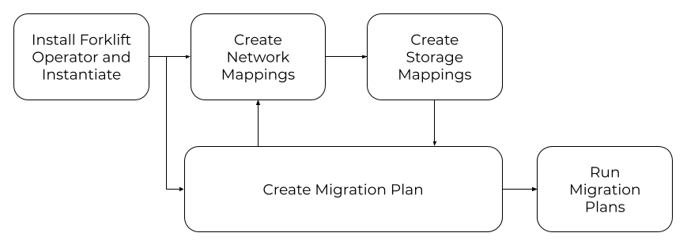

## Overview of Forklift

I introduce the Forklift project and talk about the main value of Forklift within a few lines.

## How Forklift fits into the overall Konveyor landscape

I refer to the following diagram to explain how Forklift solves the **rehost** issue for VM migration to Kubernetes 

> :construction: Questions for the SME

1. Is Migration Toolkit for Virtualization part of the downstream project? My guess is MTV is the downstream bit and Forklift is the upstream bit. Please confirm.

## How Forklift works

I use the following diagram and [this video](https://www.youtube.com/watch?v=mY4mw6negQ4) to explain how Forklift works.  

> :construction: Questions for the SME

1. What are the benefits of using Forklift to migrate VMs and not using KubeVirt directly?

## How to get involved with the Forklift project

Ready to try Forklift to migrate your VM workload? I provide all the social platforms and channel links for folks to join/follow.