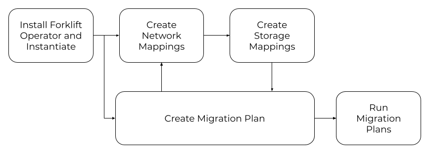

## Overview of Forklift
 
Have you ever thought of climbing Mt. Everest? When you have hundreds of legacy VMs on your cloud-native journey, you might feel just as daunted. In this blog, I’ll be introducing an open-source tool [Forklift](https://github.com/konveyor/forklift/) that helps mass migration of hundreds of VMs. Forklift uses another popular open-source tool called [KubeVirt](https://kubevirt.io/) to help you get to the basecamp and prepare you on your way to the summit. 
 
## How Forklift fits into the overall Konveyor landscape
 
Forklift is part of the larger [Konveyor](https://www.konveyor.io/) umbrella community. Once you assess/analyze your existing applications and workloads using [Tackle](https://github.com/konveyor/tackle), Forklift helps on the rehosting bit of VM migration. Using Forklift, you can either migrate VMs to Kubernetes via KubeVirt or OpenShift using OpenShift Virtualization.

 
## How Forklift works
 
Installed as an operator, the open-source Forklift is targeted to Kubernetes and the downstream Migration Toolkit for Virtualization is targeted to OpenShift. Once it is installed, it can be used through the UI or consumed via CLI or API. The first step is to add the “providers” which means specifying the source VMs and their destination(s). For example, you can add a VMware provider by entering the hostname or IP address, username/password and certificate SHA1 fingerprint. If the credentials are valid, this will create a source endpoint showing all the clusters, hosts, VMs and their networks/datastores. Once you’ve added the source and target providers, the next step is to create the network and storage mappings. Your source VM networks will be mapped to pod networks in the target cluster/namespaces The source datastores will be mapped to target cluster storage classes. The final step is to create a migration plan and specify a set of VMs that you are migrating over.  
 

 
## How to get involved with the Forklift project
 
Ready to try Forklift to migrate your VM workload? The Forklift [GitHub repository](https://github.com/konveyor/forklift/) as well as the [Google group](https://groups.google.com/g/forklift-dev) are great places to start. 
