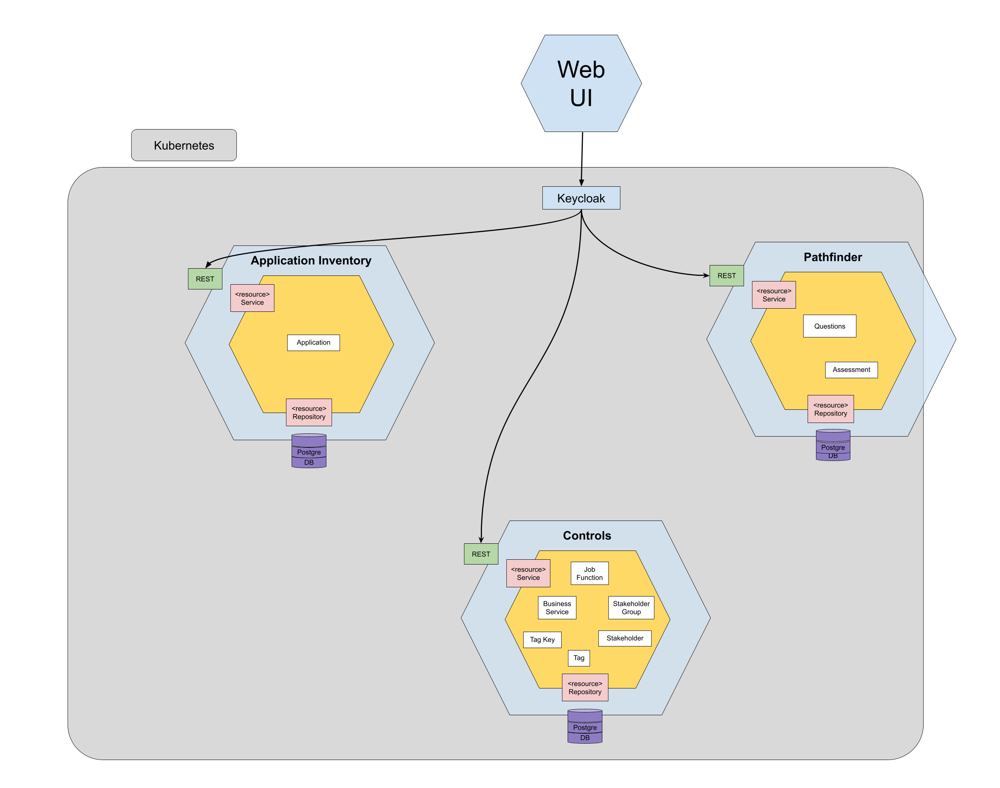

## Overview of Tackle

Your containerization and journey to Kubernetes might be easier if you have a green field. But what if it's the complete opposite? What if you have hundreds of legacy applications alongside their dependencies for dozens of business services? The open-source [Tackle](https://www.konveyor.io/tackle) tool, as part of the [Konveyor](https://www.konveyor.io) project, helps you assess your application portfolio to get recommendations in your journey to Kubernetes. This blog talks about the tools that make up Tackle and how they help streamline the modernization and migration of your application portfolio to Kubernetes.   

## How Tackle fits into the overall Konveyor landscape

Tackle is one of the projects under the larger Konveyor umbrella project. Let's use the following diagram to discuss how Tackle fits in and what problems is it addressing.

The first Tackle block (the hub) on the above diagram refers to the [Tackle Pathfinder](https://github.com/konveyor/tackle-pathfinder) tool that is used to assess the application portfolio first and come up with the migration strategy to follow with each application or application type. The next Tackle block (in the **refactor** path) - Tackle Analyze, is used to detect what needs to be changed for all the applications assessed by Tackle Pathfinder to run on the target environment and provide guidelines and some degree of automation on how to perform these changes. 

Once your applications are assessed by Tackle, they can be rehosted using [Crane](https://www.konveyor.io/crane) or [Forklift](https://forklift.konveyor.io/), replatformed using [Move2Kube](https://move2kube.konveyor.io/), and/or refactored using other tools that are part of the Tackle project.   

## How Tackle components come together to help you assess applications to migrate to Kubernetes

Tackle comprises multiple tools - each of which functions as a stand-alone component now (with a vision to integrate and function as a single component in the future). This blog will highlight the two main tools - Pathfinder and Application Inventory and discuss other tools in a future blog as the Tackle project matures.

[Tackle Application Inventory](https://github.com/konveyor/tackle-application-inventory) allows users to maintain their portfolio of applications, link them to the business services that they support, define their interdependencies, and use an extensible tagging model to add metadata to describe and categorize them in multiple dimensions. The Application Inventory is the vehicle by which an application can be selected for assessment by Pathfinder.

[Tackle Pathfinder](https://github.com/konveyor/tackle-pathfinder) is a questionnaire-based tool that assesses the suitability of applications for modernization in order to be deployed in Containers on an enterprise Kubernetes platform. Through interaction with the questionnaire, and review process, the system is enriched with application knowledge which is exposed via a collection of reports. The reports provide information about applications’ suitability for Kubernetes, highlight associated risks, and generate an adoption plan informed by the applications’ prioritization, business criticality, and dependencies.

Both Application Inventory and Pathfinder tools are accessible from a common [Tackle UI](https://github.com/konveyor/tackle-ui/).

Besides the above two tools, there are [Tackle DiVA](https://github.com/konveyor/tackle-diva), [Tackle Test Generator](https://github.com/konveyor/tackle-test-generator-cli), and [Tackle Container Advisor](https://github.com/konveyor/tackle-container-advisor) which will be discussed in a future blog. 

## How to get involved with the Tackle project

Ready to give Tackle a try? Start [here](https://www.konveyor.io/tackle).

Have a question or just would like to say "hi"? Join the [Tackle Mailing List](https://groups.google.com/g/tackle-dev) or join the #konveyor channel on slack.k8s.io

